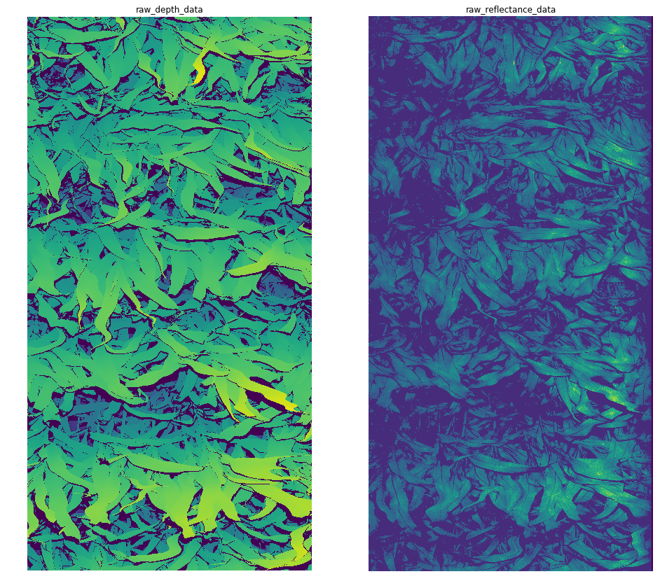
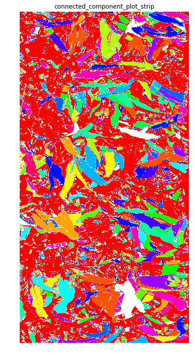
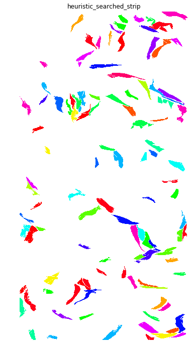
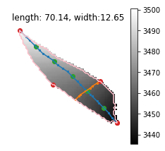

**Leaf Length and Leaf Width**
==============================

**Authors**
===========

Zeyu Zhang, Robert Pless

**Overview**
============

**Description**
---------------

This pipeline uses 3D scanner point cloud and raw data to find leaves
and compute the leaf length.

1.  Using the connected component algorithm to find the candidate leaf
    > regions 
    >
    >
    > 

2.  Heuristic search leaves based on the component shape and area

3.  For each leaf, build a weighted graph **G: (v, e)** where **v** is
    > the pixels inside the leaf, and the **e** is the distance between
    > pixel and its neighbor (two points are neighbors if their distance
    > within the image coordinate is less than a threshold).

> 
>
> Fig 3. Illustration of the leaf length and width. The pink contour is
> the outline of the leaf. The blue line is the path of leaf length and
> the orange line is the path of leaf width. Red dots shows the vertices
> of the approximated polygon. Green dots shows the quinquesection
> points on the path of leaf length.

4.  Find leaf length:

    a.  Find the approximated polygon of the leaf contour using
        > Douglas-Peucker algorithm.

    b.  For all pairs of points on the approximated polygon, find the
        > longest shortest path. **The length of this path is considered
        > as the leaf length.**

5.  Find leaf width:

    c.  Find quinquesection points on the leaf length path.

    d.  For each quinquesection point **i**,

        i.  Find the point **a** on the edge that has the shortest path
            > to the point **i**

        ii. From the points that on the opposite of the **a** with
            > respect to **i**, find the point **b** has the shortest
            > path to the point **i**.

        iii. The shortest path from **a** to **b** on the graph **G** is
            > the candidate leaf width.

    e.  Choose the longest path from the candidate leaf width path as
        > the leaf width.

6.  After getting the whole season result, average the measurement per
    > day per plot

7.  Using kalman filter to filter the result along the time for each
    > plot

8.  Find the peak point and only keep the measurement before the peak.

**Inputs**
----------

3D scanner raw data and point cloud data.

**Outputs**
-----------

CSV file that contains the leaf length of each plot per day

**Implementation**
==================

**Libraries used**
------------------

Pandas

Numpy

Scipy

Sklearn-image

Networkx

**References**
--------------

Connected component:
[https://en.wikipedia.org/wiki/Connected\_component\_(graph\_theory)]{.underline}

Weighted graph:
[http://mathworld.wolfram.com/WeightedGraph.html]{.underline}

Douglas, David H., and Thomas K. Peucker. \"Algorithms for the reduction
of the number of points required to represent a digitized line or its
caricature.\" *Cartographica: The International Journal for Geographic
Information and Geovisualization* 10.2 (1973): 112-122.

**Rationale (e.g. why method x over y)**
----------------------------------------

**QA/QC**
=========

**Failure conditions**
----------------------

**Known issues**
----------------

1.  When the plants grown, overlaps among leaves breaks leaves into
    > pieces. Which result the measured leaf length goes down in the
    > latter season.

2.  There is some noise (missing points in the point cloud) that can
    > break the leaves apart. This may caused by the over/under exposure
    > in the scanner reflection data.

{width="4.942708880139983in"
height="3.941030183727034in"}
